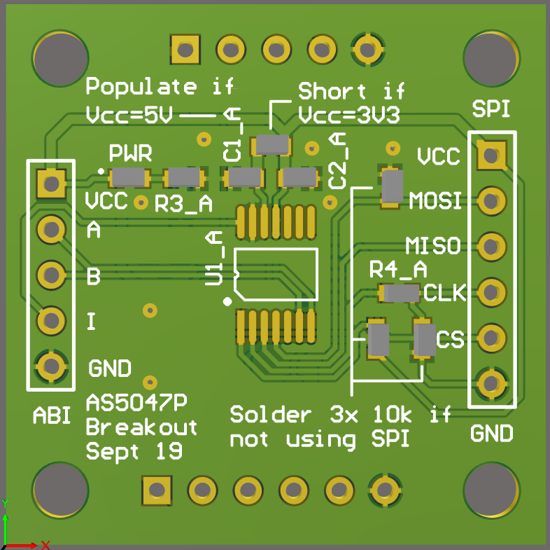
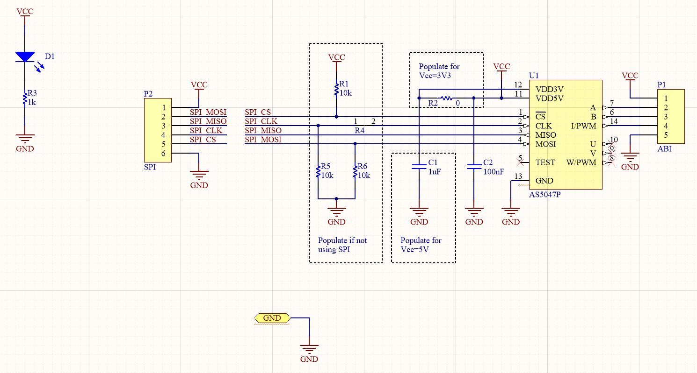
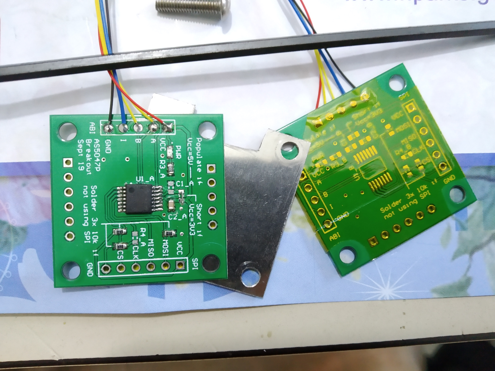

# AS5047P Breakout

Breakout board based on the development board AS5047P-TS_EK_AB.

Schematics (duplicated on both sides):

This board was intended to allow mounting of two AS5047P back to back, but it was found in testing that some sort of magnetic shield needed to be placed between the two AS5047P so that the magnets do not interfere with the opposite sensor.

ABI has been tested ok. Note the kapton tape to prevent shorting against the magnetic shield.

